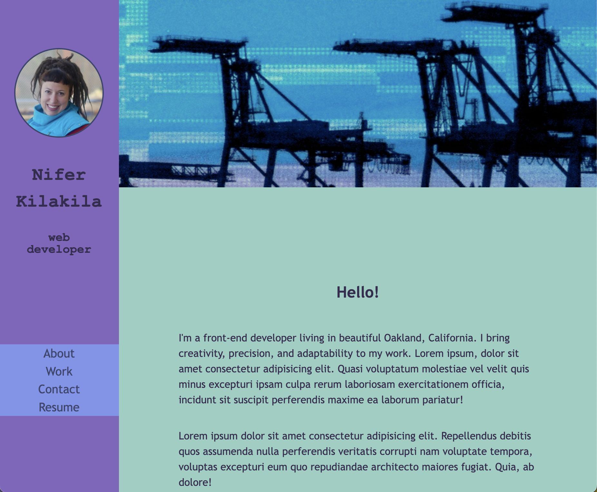

 # Project Name - Nifer Kilakila Portfolio

## Table of contents

- [Overview](#overview)
  - [The challenge](#the-challenge)
  - [User Story](#user-story)
  - [Acceptance Criteria](#acceptance-criteria)
  - [Screenshot](#screenshot)
- [My process](#my-process)
  - [Built with](#built-with)
  - [Continued development](#continued-development)
  - [Useful resources](#useful-resources)
- [Author](#author)
- [Acknowledgments](#acknowledgments)

## Overview

Creating a web application from scratch.

### The challenge

The challenge is to create a web application from scratch by applying the core skills I've recently learned: flexbox, media queries, and CSS variables.

** PLEASE NOTE: It was permitted that if I don't have enough web applications to showcase at this point, to use placeholder images and names. I will change them to real applications as I create them later in the course. **

### User Story

AS AN employer
I WANT to view a potential employee's deployed portfolio of work samples
SO THAT I can review samples of their work and assess whether they're a good candidate for an open position

### Acceptance Criteria

GIVEN I need to sample a potential employee's previous work
WHEN I load their portfolio
THEN I am presented with the developer's name, a recent photo or avatar, and links to sections about them, their work, and how to contact them
WHEN I click one of the links in the navigation
THEN the UI scrolls to the corresponding section
WHEN I click on the link to the section about their work
THEN the UI scrolls to a section with titled images of the developer's applications
WHEN I am presented with the developer's first application
THEN that application's image should be larger in size than the others
WHEN I click on the images of the applications
THEN I am taken to that deployed application
WHEN I resize the page or view the site on various screens and devices
THEN I am presented with a responsive layout that adapts to my viewport

### Screenshot

### Links

- Live Site URL: [Nifer Kilakila Portfolio on GitHub](https://nanifer.github.io/Nifer-Kilakila-Portfolio-h2/)

### Built with
- Semantic HTML5 markup
- CSS

### What I learned

In this project, gained a deeper understanding of html and CSS. As a complete newbie into the feild, almost all of it was brand new to me. This project was a series of trial and error, that resulted in a substantial acquisition of knowledge in CSS & HTML.

### Continued development

Using Flexbox properties is an area that I will continue to improve upon. I am especially looking forward to studying the following two resources on the topic:
- [CSS-Tricks] (https://css-tricks.com/snippets/css/a-guide-to-flexbox/)
- [yoksel-flex-cheatsheet] (https://yoksel.github.io/flex-cheatsheet/)

### Useful resources

- [W3 Schools](https://www.w3schools.com/icons/fontawesome_icons_webapp.asp) - A great resource for much of my CSS and HTML creation, but especially helpful on this project for button, Font Awesome icons, and formatting said buttons. I'd recommend it to anyone still learning HTML & CSS.
- [CanAdapt]( https://www.davidmacd.com/blog/alternate-text-for-css-background-images.html) - This is good article that helped me figure out a hack for adding an alt text for my hero image.

## Author - Nifer Kilakila

- LinkedIn - [Nifer Kilakila](https://www.linkedin.com/in/nifer-kilakila-b0721565/)
- GitHub - [@NiferK](https://github.com/NiferK)

## Acknowledgments

Big shout out to my classmates Angie, Nolan, Ivy and Michael, who helped spot and identify some bugs along the way.
